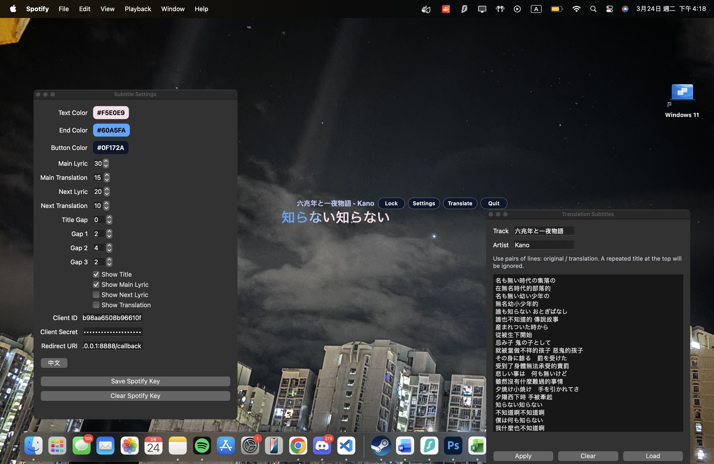

# Spotify Floating Overlay

> Note: You need a Spotify Premium account to use the Web API.

[中文](#中文說明) | [English](#english)

## 中文說明

Spotify 的透明浮動歌詞視窗，使用 Python 與 PySide6 製作。



功能：

- 從 `lrclib` 抓同步歌詞
- 透明、置頂顯示
- 主歌詞逐字變色動畫
- 可手動輸入翻譯字幕並儲存成 JSON
- 浮動小按鈕可切換移動、設定、翻譯與關閉


### 環境需求

- 建議 Python 3.11+
- Spotify Developer App credentials
- macOS 可得到目前最佳的原生置頂體驗

雖然專案本體是 PySide6，可跨平台執行，但目前「背景運行時保持置頂」的效果主要針對 macOS 做了優化。

### 安裝

```bash
python3 -m venv venv
source venv/bin/activate
pip install -r requirements.txt
```

### 執行

```bash
python mac.py
```

第一次啟動後，打開浮動 `設定` 視窗並填入：

- `Client ID`
- `Client Secret`
- `Redirect URI`

這些資料只會存在你的本機。

### Spotify 設定

請先到 [Spotify Developer Dashboard](https://developer.spotify.com/dashboard) 建立 app，`Redirect URI` 可用：

```text
http://127.0.0.1:8888/callback
```

取得 Spotify key 的流程：

1. 建立 app


2. 設定 Redirect URI


3. 取得 `Client ID` 和 `Client Secret`


### 手動翻譯字幕

打開 `翻譯` 視窗後，使用以下格式輸入：

```text
原文
翻譯
原文
翻譯
```

程式會自動把你輸入的翻譯行配對到同步歌詞，即使空格、標點有一點差異也會盡量對齊。

### 打包成 macOS App

如果你要打包 `.app`，保留：

- `build_mac_app.sh`

然後執行：

```bash
./build_mac_app.sh
```

如果 macOS 因為 Xcode tools 擋住打包，先執行：

```bash
sudo xcodebuild -license accept
```

### 補充

- repo 內沒有內建 Spotify key
- 個人設定檔不放在專案資料夾內
- 目前只使用 `lrclib` 當歌詞來源

---

## English

A transparent always-on-top Spotify lyrics overlay built with Python and PySide6.


Features:

- fetches synced lyrics from `lrclib`
- transparent floating overlay
- per-character lyric color fill animation
- manual translation subtitles saved as JSON
- floating buttons for move, settings, translation, and quit

### Requirements

- Python 3.11+ recommended
- Spotify Developer App credentials
- macOS for the best native always-on-top behavior

The app can still run cross-platform with PySide6, but the current background always-on-top behavior is mainly optimized for macOS.

### Install

```bash
python3 -m venv venv
source venv/bin/activate
pip install -r requirements.txt
```

### Run

```bash
python mac.py
```

On first launch, open the floating `設定` window and fill in:

- `Client ID`
- `Client Secret`
- `Redirect URI`

These values are stored locally on your machine.

### Spotify Setup

Create an app in the [Spotify Developer Dashboard](https://developer.spotify.com/dashboard) and use a redirect URI such as:

```text
http://127.0.0.1:8888/callback
```

How to get your Spotify key:

1. Create an app


2. Add the Redirect URI


3. Copy `Client ID` and `Client Secret`


### Manual Translation Subtitles

Open the `翻譯` window and enter lines in pairs:

```text
Original line
Translated line
Original line
Translated line
```

The app will try to align your manual translation lines to the synced lyrics even if spacing or punctuation differs slightly.

### Build A macOS App

If you want to build a `.app`, keep:

- `build_mac_app.sh`

Then run:

```bash
./build_mac_app.sh
```

If macOS blocks the build because of Xcode tools, run:

```bash
sudo xcodebuild -license accept
```

### Notes

- No Spotify keys are included in this repo
- Personal settings are stored outside the project folder
- `lrclib` is currently the only lyrics source
